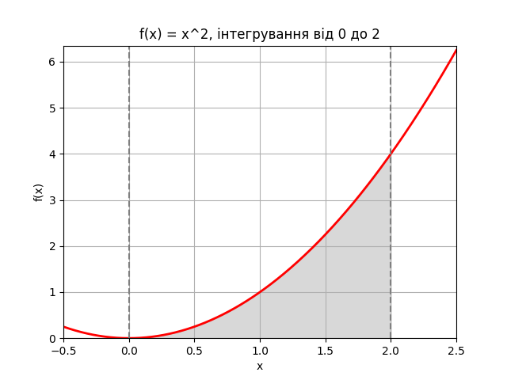

# Домашнє завдання 10: Лінійне програмування та рандомізовані алгоритми

---

## Завдання 1: Оптимізація виробництва з використанням PuLP

Було змодельовано задачу максимізації кількості вироблених напоїв (лимонад і фруктовий сік) за обмежених ресурсів: вода, цукор, лимонний сік і фруктове пюре. Метою було знайти таке співвідношення виробництва обох продуктів, щоб отримати максимальну кількість одиниць продукції.

- Змінні: `lemonade`, `fruit_juice` (цілі числа).
- Використано бібліотеку `pulp` та стандартний `CBC` solver.

**Результат:**
```
Лимонад: 30 од.
Сік: 20 од.
Загальна кількість: 50 од.
```  
Це оптимальний розв'язок, що враховує усі задані обмеження.

---

## Завдання 2: Обчислення інтегралу методом Монте-Карло

Обчислено визначений інтеграл функції \( f(x) = x^2 \) на відрізку [0, 2] методом Монте-Карло, а також перевірено результат через аналітичне обчислення з допомогою `scipy.integrate.quad()`.

- Результати:
```
Метод Монте-Карло: ~2.662640
Quad(): 2.666667
```
- Похибка: < 0.2%

---

## Візуалізація



На графіку видно функцію \( x^2 \) і заштриховану область під кривою, яка відповідає площі (значенню інтегралу).

---

## Висновки

- У **Завданні 1** використання PuLP дозволило ефективно сформулювати і вирішити задачу з лінійними обмеженнями. Результат чітко демонструє, як можна оптимізувати виробництво при фіксованих ресурсах.
- У **Завданні 2** метод Монте-Карло дав дуже близьке до аналітичного значення, що підтверджує його коректність навіть при меншій кількості випадкових точок. Метод є корисним для складніших функцій або вищих вимірностей, де аналітичні методи не працюють.


